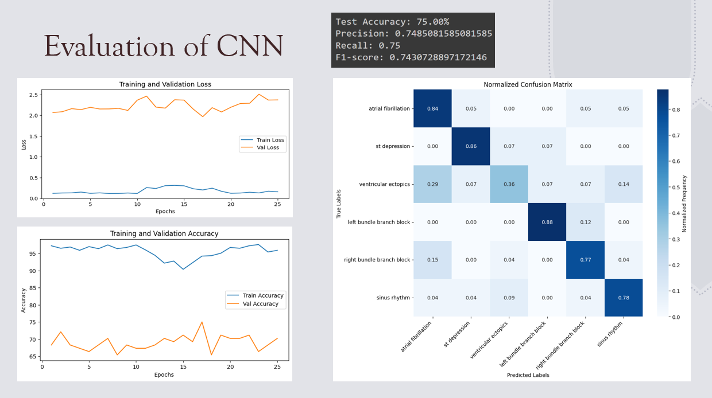
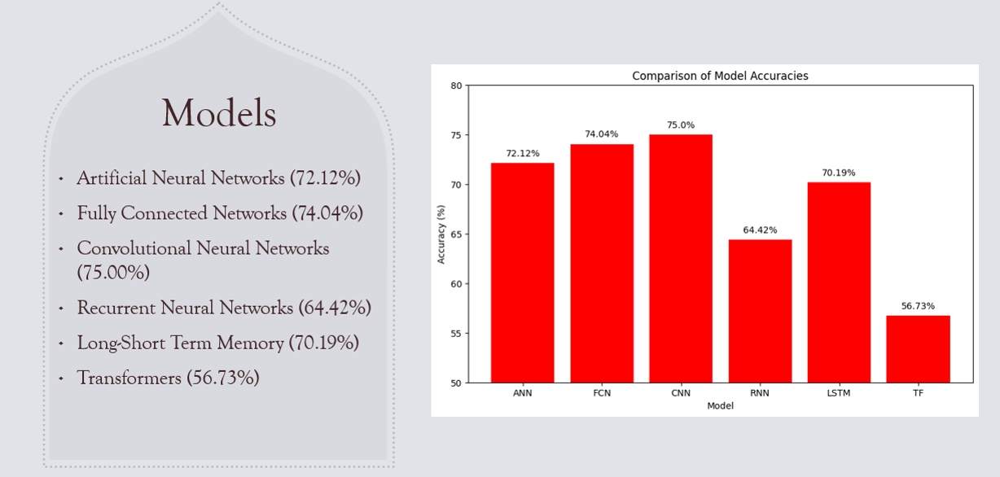

# Advancing Automated ECG Interpretation

This project aims to develop a robust deep learning model capable of identifying 18 distinct cardiac abnormalities from a dataset comprising 43,100 12-lead ECG recordings. By leveraging machine learning algorithms, the model strives to improve the accuracy and efficiency of ECG interpretation, assisting healthcare professionals in making informed clinical decisions.

## Course Information
This project was completed as part of the Big Data Analytics (CS 586) course in Spring 2024 at Worcester Polytechnic Institute (WPI). The course focused on big data techniques, including data processing, machine learning, and predictive analytics, with this project applying deep learning for ECG signal classification.

## Technologies Used

- Python
- TensorFlow / Keras
- NumPy, pandas
- Scikit-learn
- Matplotlib, Seaborn

## Data Sources

The dataset was gathered from multiple institutions, including:
- Southeast University, China
- St. Petersburg Institute of Cardiological Technics
- Physikalisch Technische Bundesanstalt (PTB)
- Georgia University

The data includes ECG signals recorded from various heart leads, with each entry annotated with diagnostic codes corresponding to specific cardiac conditions.

## Key Findings

- The CNN model achieved the highest accuracy in diagnosing ECG abnormalities, highlighting its potential for practical use.
- Overfitting was observed in some models, particularly with the CNN, suggesting the need for better regularization.

CNN Evaluation: The model achieved 75% test accuracy with good performance on atrial fibrillation and st depression, as shown in the confusion matrix, though it struggles with ventricular ectopics.
This plot shows the evaluation of the CNN model, including training/validation loss, accuracy, and a normalized confusion matrix:

 Here, the accuracy of various models is displayed, including ANN, FCN, CNN, RNN, LSTM, and Transformers:

## Files descripton
- `single_files_csv.py`: Code for converting files to CSV format.
- `merged_files.py`: Code for merging files from the `single_files_csv` folder and integrating with SNOMED CT codes.
- `models.py`: Code for EDA and models used in the project.
- Project Report.pdf

## Contributors
- Antonela Tamagnini
- Alexander Mitchell
- Arsalan Saif
- Aayush Sangani
- Tanish Kandivlikar
